# 📸 Hybrid Photo Enhancer

<p align="center">
  
</p>

<p align="center">
  <strong>Restoring detail, correcting optics, and preserving memories with authentic fidelity.</strong>
</p>

<p align="center">
  
  
  
  
  
  
  
</p>

---

## 🌟 Overview

Modern AI photo enhancers often rely heavily on generative restoration. While powerful, aggressive enhancement can introduce unwanted details, alter facial features, or shift the original character and color of an image.

**Hybrid Photo Enhancer** takes a different approach.

The project combines **classical Computer Vision and Image Processing** with **modern deep learning models** to build a modular, explainable, and privacy-first photo enhancement pipeline.

The system is designed around three practical photography problems:

### 📱 The 24mm Smartphone Dilemma

Many mid-range smartphones rely primarily on a wide-angle main camera operating around **1× zoom (~24mm full-frame equivalent)** without dedicated optical telephoto hardware.

When used for close-up portraits, wide-angle optics can introduce:

* Perspective stretching
* Barrel distortion
* Enlarged facial features near the center
* Elongation near image edges

A more natural portrait perspective is typically associated with approximately **50–85mm equivalent focal lengths**.

### 🔎 The Digital Zoom Softness Trap

When switching to 2× zoom on phones without a dedicated 2× telephoto camera, the device may effectively crop into the main sensor.

This can result in:

* Reduced spatial detail
* Interpolation artifacts
* Increased visibility of sensor noise
* Soft facial and texture details

The enhancer attempts to recover some of this perceived quality using a combination of classical image processing and AI-based reconstruction.

### 🧠 The CVIP Learning Objective

This project was built as a hands-on exploration of **Computer Vision and Image Processing (CVIP)**.

It experiments with how mathematical transformations and traditional image-processing techniques can be combined with deep learning architectures such as:

* **Real-ESRGAN** — Super-resolution
* **GFPGAN** — Face restoration
* **Restormer** — Image deblurring
* **OpenCV** — Geometric correction and classical enhancement

> [!NOTE]
> This is an experimental learning project rather than a replacement for optical telephoto hardware. The goal is to explore the trade-offs between classical computer vision, deep learning, detail recovery, and image authenticity.

---

## 🚀 Key Features

### 1. 🔍 Camera & Distortion Correction

Classical computer vision techniques are used to address optical and digital capture limitations.

* **Wide-Angle Distortion Correction**

  * Uses camera intrinsic parameters and radial distortion models.
  * Applies OpenCV geometric remapping to correct wide-angle barrel distortion.

* **Digital 2× Quality Recovery**

  * Combines edge-preserving bilateral filtering with high-frequency sharpening.
  * Attempts to recover perceived detail from digitally cropped images.

---

### 2. 🧠 Deep Learning Super-Resolution & Deblurring

#### Real-ESRGAN

Supports AI-based image upscaling using **Real-ESRGAN / RRDBNet**.

* 2× and 4× super-resolution
* Anime-oriented enhancement mode
* Residual-in-Residual Dense Blocks
* Tiled inference for memory-efficient processing

#### VRAM-Aware Tiling

Large images are divided into smaller overlapping tiles before AI inference.

This allows the application to process high-resolution images while reducing GPU memory requirements.

#### Restormer

The pipeline optionally uses **Restormer** for image deblurring.

Restormer's **Multi-Dconv Head Transposed Attention (MDTA)** operates primarily across channel dimensions, providing an efficient transformer-based approach to image restoration.

---

### 3. 👤 Face Restoration & Natural Finishing

#### GFPGAN Face Restoration

Uses pre-trained facial priors to reconstruct degraded facial details such as:

* Eyes
* Mouth
* Facial contours
* Fine facial structure

#### Edge-Preserving Skin Smoothing

Localized bilateral filtering is applied to detected facial regions to reduce harsh restoration artifacts while retaining important edges.

#### Color Preservation

The pipeline separates luminance and chrominance information during parts of the finishing process to reduce unwanted color changes introduced by AI restoration.

#### 🕰️ Old Photo Mode

Designed for scanned or degraded photographs using:

* Non-Local Means Denoising
* CLAHE — Contrast Limited Adaptive Histogram Equalization
* Contrast enhancement
* Noise reduction

---

### 4. 🎛️ Modular Processing Pipeline

Each processing stage can be independently enabled or skipped.

Available stages include:

* Distortion correction
* Digital zoom enhancement
* Old-photo restoration
* Deblurring
* AI upscaling
* Face restoration
* Final sharpening
* Saturation adjustment
* Print/export configuration

This allows the application to function as either a complete restoration pipeline or as a collection of individual image-processing tools.

### 📦 Batch Processing

* Multiple-image processing
* Automatic progress tracking
* ZIP packaging
* Local output management

### 🖨️ Print-Ready Export

Configurable output settings include:

* Sharpening strength
* Saturation
* JPEG quality
* Target PPI

  * 72 PPI
  * 300 PPI
  * 600 PPI

---

## 🏗️ System Architecture

```mermaid
flowchart LR
    A[React + TypeScript UI] -->|Multipart Form Data| B[FastAPI Gateway]

    B --> C[Validation & Normalization]

    C --> D{Capture Correction}

    D -->|Wide-Angle Fix| D1[OpenCV Radial Undistort]
    D -->|Digital 2x| D2[Bilateral Denoise + Unsharp]
    D -->|Standard / Skip| E{Old Photo Mode}

    D1 --> E
    D2 --> E

    E -->|Enabled| E1[NL-Means + CLAHE]
    E -->|Disabled| F{Restormer Deblur}

    E1 --> F

    F -->|Motion / Defocus| F1[MDTA Transformer]
    F -->|Skip| G{AI Upscaling}

    F1 --> G

    G -->|Real-ESRGAN x2 / x4| G1[RRDBNet Tiled Inference]
    G -->|Skip| H{Face Restoration}

    G1 --> H

    H -->|GFPGAN Enabled| H1[Facial Priors + Skin Smoothing + Color Blend]
    H -->|Disabled| I[Finishing Pass]

    H1 --> I

    I -->|Sharpen + Saturation + PPI| J[JPEG / Batch ZIP]

    J -->|Stream Output| A
```



---

## 📂 Project Structure

```text
Hybrid-Photo-Enhancer/
│
├── api.py                         # FastAPI REST API
├── app.py                         # Standalone Gradio application
├── start-app.ps1                  # PowerShell launcher
├── start-app.bat                  # Windows launcher
├── requirements.txt               # Python dependencies
│
├── frontend/
│   ├── src/
│   │   ├── App.tsx                # Main application component
│   │   ├── App.css                # Component styles
│   │   ├── index.css              # Global styles and design tokens
│   │   └── main.tsx               # React entry point
│   │
│   ├── package.json               # Frontend dependencies
│   └── vite.config.ts              # Vite configuration
│
├── src/
│   ├── models/
│   │   ├── ai_upscaler.py         # Real-ESRGAN & GFPGAN adapters
│   │   └── restormer.py           # Restormer inference
│   │
│   └── processing/
│       └── classical_enhancer.py  # Classical CV processing
│
├── models/                         # Model weights
└── outputs/                        # Generated images
```

---

## 💻 Tech Stack

| Category            | Technologies                                          |
| ------------------- | ----------------------------------------------------- |
| **Frontend**        | React 19, TypeScript, Vite, Vanilla CSS, Lucide React |
| **Backend**         | Python 3.10+, FastAPI, Uvicorn, Pydantic              |
| **Deep Learning**   | PyTorch, Real-ESRGAN, GFPGAN, Restormer               |
| **Computer Vision** | OpenCV, NumPy, Pillow, SciPy                          |
| **Automation**      | PowerShell, Windows Batch                             |

---

## 🔒 Privacy by Design

Privacy is a core design principle of the application.

* **100% Local Processing** — Images are processed directly on the user's workstation.
* **No Cloud Uploads** — Photos are not sent to external APIs or cloud processing services.
* **Local AI Inference** — Deep learning models run locally using available CPU/GPU resources.
* **Clean Repository** — Model weights, caches, virtual environments, and generated outputs are excluded from version control.

Your photos stay on your machine.

---

## ⚡ Quick Start

### Prerequisites

* Windows 10/11, macOS, or Linux
* Python 3.10+
* Node.js 18+
* npm
* NVIDIA GPU with CUDA support *(recommended)*
* CPU inference is also supported

### 1. Clone the Repository

```bash
git clone https://github.com/Mesit-Rathnayake/Hybrid-Photo-Enhancer.git
cd Hybrid-Photo-Enhancer
```

### 2. Set Up the Python Environment

```bash
python -m venv .venv
```

Activate the environment:

**Windows PowerShell**

```powershell
.\.venv\Scripts\Activate.ps1
```

Install dependencies:

```bash
pip install -r requirements.txt
```

### 3. Install Frontend Dependencies

```bash
cd frontend
npm install
cd ..
```

### 4. Launch the Application

#### Windows

You can either double-click:

```text
start-app.bat
```

or run:

```powershell
.\start-app.ps1
```

The launcher:

1. Checks the Python environment.
2. Verifies frontend dependencies.
3. Starts the FastAPI backend.
4. Starts the Vite development server.
5. Performs service health checks.
6. Opens the application in your default browser.

Default development endpoints:

```text
Backend  → http://127.0.0.1:8000
Frontend → http://127.0.0.1:5173
```

---

## 📐 Mathematical & CVIP Concepts

The project applies several classical computer vision and image-processing concepts.

### 1. Brown-Conrady Radial Distortion

Radial distortion can be modeled as:

```text
x' = x(1 + k₁r² + k₂r⁴ + k₃r⁶)
y' = y(1 + k₁r² + k₂r⁴ + k₃r⁶)
```

where:

* `x, y` — Original normalized coordinates
* `x', y'` — Distorted/undistorted coordinates
* `k₁, k₂, k₃` — Radial distortion coefficients
* `r` — Distance from the optical center

---

### 2. Pinhole Camera Intrinsic Matrix

The camera intrinsic matrix is represented as:

```text
        ┌             ┐
        │ fx   0   cx │
K   =   │ 0   fy   cy │
        │ 0    0    1 │
        └             ┘
```

where:

* `fx, fy` — Focal lengths in pixel units
* `cx, cy` — Principal point coordinates

---

### 3. Bilateral Filtering

Bilateral filtering combines spatial and intensity similarity:

```text
I_filtered(p) =
    1 / Wp × Σ I(q)
    × exp(-||p-q||² / 2σs²)
    × exp(-||I(p)-I(q)||² / 2σr²)
```

Unlike conventional Gaussian smoothing, bilateral filtering can reduce noise while preserving important edges.

---

### 4. Gaussian Unsharp Masking

Sharpening is performed using:

```text
I_sharp = I + α(I - Gσ * I)
```

where:

* `I` — Original image
* `Gσ * I` — Gaussian-blurred image
* `α` — Sharpening strength
* `σ` — Gaussian standard deviation

---

## 🧪 Continuous Learning & Future Work

This project is also an ongoing CVIP learning playground.

Potential future improvements include:

* [ ] Automatic camera calibration using EXIF metadata
* [ ] Dynamic focal-length estimation
* [ ] Face parsing masks for multi-person portraits
* [ ] ONNX Runtime optimization
* [ ] TensorRT acceleration
* [ ] Faster GPU inference
* [ ] Guided scratch and dust removal
* [ ] AI-assisted archival photo inpainting
* [ ] More advanced camera/lens profiles

---

## 📄 License

This project incorporates open-source models and libraries with their own licenses.

Please review the respective licenses before redistributing or modifying the associated components.

* [Real-ESRGAN](https://github.com/xinntao/Real-ESRGAN) — BSD-3-Clause
* [GFPGAN](https://github.com/TencentARC/GFPGAN) — Apache 2.0
* [Restormer](https://github.com/swz30/Restormer) — Apache 2.0

---

## ⭐ Project Philosophy

> **Classical Computer Vision for control.
> Deep Learning for reconstruction.
> Local processing for privacy.**

Hybrid Photo Enhancer is an exploration of what happens when traditional image-processing mathematics and modern AI restoration are treated as complementary tools rather than competing approaches.
