# 📸 Hybrid Photo Enhancer

<p align="center">
  
</p>

<p align="center">
  <strong>Restoring detail, correcting optics, and preserving memory with authentic fidelity.</strong>
</p>

<p align="center">
  
  
  
  
  
  
  
</p>

---

## 🌟 The Motive & Background

Most modern AI photo enhancers treat image restoration as an aggressive generative hallucination task—often turning genuine human faces into waxy, plastic dolls and shifting vintage color palettes. Furthermore, consumer photography suffers from real-world optical constraints that pure generative models ignore:

1. **The 24mm Smartphone Dilemma:** In most mid-range smartphones, the primary high-resolution sensor operates strictly at **1x zoom (~24mm full-frame equivalent)** without dedicated optical telephoto glass. In photography, **50mm to 85mm** is the standard focal range for natural portraits. Close-up shots at 24mm cause pronounced **barrel distortion and perspective stretching** (prominent centers and elongated edges).
2. **The Digital Zoom Softness Trap:** When users switch to 2x zoom on mid-range phones, the camera merely performs a digital crop into the 1x sensor, resulting in soft, interpolated pixels and amplified sensor noise.
3. **The CVIP Learning Objective:** Built as a hands-on exploration of **Computer Vision and Image Processing (CVIP)**, this project investigates how classical mathematical transformations (OpenCV geometry remapping, bilateral filtering, unsharp masking, and color-space decomposition) can be composed with deep learning architectures (Real-ESRGAN, GFPGAN, Restormer) into a unified, explainable, and local-first application.

> [!NOTE]
> This project is designed as an experimental learning playground to test tool capabilities and understand image processing trade-offs. While an algorithm cannot physically replace optical telephoto glass, combining classical CV with modern models achieves a natural balance between detail recovery and authenticity.

---

## 🚀 Key Highlights & Features

### 1. 🔍 Camera & Distortion Correction (Classical CV)
- **Wide-Angle Distortion Correction:** Uses pinhole camera intrinsic matrices and polynomial radial distortion remapping (`cv2.undistort`) to flatten 24mm wide-angle barrel distortion on portraits without compressing proportions.
- **Digital 2x Quality Recovery:** Combines edge-preserving bilateral filtering with high-frequency contrast recovery to clean up softness and noise from digital zoom sensor crops.

### 2. 🧠 Deep Learning Super-Resolution & Deblurring
- **Real-ESRGAN Super-Resolution (x2 / x4 / Anime):** Residual-in-Residual Dense Blocks (RRDBNet) with sub-pixel convolution upsampling.
- **VRAM-Aware Tiling:** Divides high-resolution tensors into spatial chunks with overlap blending to prevent GPU out-of-memory errors on consumer hardware.
- **Restormer Transformer Deblurring:** Multi-Dconv Head Transposed Attention (MDTA) operating across channel dimensions ($O(C^2)$ complexity) to invert motion blur and defocus softness.

### 3. 👤 Localized Face Reconstruction & Natural Finishing
- **GFPGAN Face Restoration:** Restores degraded facial landmarks (eyes, mouth, contours) using pre-trained facial priors.
- **Edge-Preserving Skin Smoothing:** Localized Bilateral Filtering inside Haar-cascade face masks softens harsh artifacts while preserving natural edges.
- **Color Preservation:** Luminance-chrominance separation (LAB/RGB blending) ensures reconstructed facial details match the original photo's tone without artificial GAN color shift.
- **Old-Photo Mode:** Non-Local Means Denoising coupled with Contrast-Limited Adaptive Histogram Equalization (CLAHE) for vintage and worn photo scans.

### 4. 🎛️ Modular Execution & Granular Print Export
- **Flexible Skip Modes:** Each stage (Upscaling, Distortion Correction, Deblurring, Face Restoration) can be individually toggled or bypassed (`None / Skip`), allowing users to run *only* distortion correction, *only* deblurring, or *only* finishing.
- **Print-Ready Metadata:** Configurable sharpening strength, saturation adjustments, JPEG quality, and target export PPI (72, 300, 600).
- **Batch Processing:** Multi-image queueing with automatic progress tracking and ZIP packaging.

---

## 🏗️ System Architecture

```mermaid
flowchart LR
    A[React + TS Web UI] -->|Multipart Form-Data| B[FastAPI Gateway]
    B --> C[Validation & Normalization]
    
    C --> D{Capture Correction}
    D -->|Wide-Angle Fix| D1[OpenCV Radial Undistort]
    D -->|Digital 2x| D2[Bilateral Denoise + Unsharp]
    D -->|Standard / Skip| E{Old Photo Mode}
    D1 --> E
    D2 --> E
    
    E -->|Enabled| E1[NL-Means + CLAHE]
    E -->|Disabled| F{Restormer Deblur}
    E1 --> F
    
    F -->|Motion / Defocus| F1[MDTA Transformer]
    F -->|Skip| G{AI Upscaling}
    F1 --> G
    
    G -->|Real-ESRGAN x2/x4| G1[RRDBNet Tiled Inference]
    G -->|Skip Model| H{Face Restoration}
    G1 --> H
    
    H -->|GFPGAN Enabled| H1[Facial Priors + Skin Smooth + Color Blend]
    H -->|Disabled| I[Finishing Pass]
    H1 --> I
    
    I -->|Sharpen + Saturation + PPI| J[JPEG / Batch ZIP]
    J -->|Stream Output| A
```



---

## 📂 Project Structure

```text
Hybrid-Photo-Enhancer/
├── api.py                     # FastAPI REST endpoints with multipart handling
├── app.py                     # Standalone Gradio web application
├── start-app.ps1              # Unified PowerShell launcher with health checks & live reload
├── start-app.bat              # Double-clickable Windows launcher
├── requirements.txt           # Python dependencies (PyTorch, OpenCV, FastAPI, etc.)
│
├── frontend/                  # Modern React + TypeScript interface
│   ├── src/
│   │   ├── App.tsx            # Main application component & pointer slider logic
│   │   ├── App.css            # Component styles, toggle switches, and responsive layout
│   │   ├── index.css          # Design system tokens and global form styles
│   │   └── main.tsx           # React entry point
│   ├── package.json           # Frontend dependencies (Lucide icons, Vite, TypeScript)
│   └── vite.config.ts         # Vite bundler configuration
│
├── src/
│   ├── models/
│   │   ├── ai_upscaler.py     # Real-ESRGAN & GFPGAN inference adapters with direct 1x mode
│   │   └── restormer.py       # Restormer transformer deblurring loader & execution
│   └── processing/
│       └── classical_enhancer.py # Lens distortion correction, CLAHE, bilateral smoothing
│
├── models/                    # Model weights directory (downloaded on demand)
└── outputs/                   # Local processing output destination (excluded from git)
```

---

## 💻 Tech Stack

| Domain | Technologies & Libraries |
| :--- | :--- |
| **Frontend** | React 19, TypeScript, Vite, Vanilla CSS Design System, Lucide React Icons |
| **Backend & API** | Python 3.10+, FastAPI, Uvicorn, Pydantic |
| **Deep Learning** | PyTorch, Real-ESRGAN (RRDBNet), GFPGAN (v1.4), Restormer (MDTA) |
| **Computer Vision** | OpenCV (`cv2`), NumPy, Pillow (`PIL`), SciPy |
| **Local Automation** | PowerShell Scripting, Batch Automation |

---

## 🔒 Privacy by Design

- **100% Local Processing:** Every photo is processed directly on your local workstation GPU/CPU.
- **Zero Cloud Uploads:** No external APIs or cloud servers receive your photos.
- **Clean Repository:** Model weights, caches, virtual environments, and generated output files are excluded from version control.

---

## ⚡ Quickstart & Running Locally

### Prerequisites
- Windows 10/11, macOS, or Linux
- Python 3.10+ (with virtual environment at `.venv`)
- Node.js 18+ & npm (for frontend)
- NVIDIA GPU with CUDA support (recommended, but CPU inference is fully supported)

### 🚀 One-Click Launch (Windows)

Simply double-click the **`Launch AI Photo Enhancer.bat`** on your Desktop, or run:

```powershell
.\start-app.ps1
```

The launcher will:
1. Verify the Python virtual environment and frontend dependencies.
2. Start the **FastAPI backend** (`http://127.0.0.1:8000`) with live reloading.
3. Start the **Vite React frontend** (`http://127.0.0.1:5173`).
4. Wait for both services to be healthy and automatically open the application in your default web browser.

---

## 📐 Mathematical & CVIP Concepts Applied

- **Brown-Conrady Radial Distortion Model:**
  $$\begin{bmatrix} x_{undistorted} \\ y_{undistorted} \end{bmatrix} = \begin{bmatrix} x \\ y \end{bmatrix} \left( 1 + k_1 r^2 + k_2 r^4 + k_3 r^6 \right)$$
- **Pinhole Camera Intrinsic Matrix ($K$):**
  $$K = \begin{bmatrix} f_x & 0 & c_x \\ 0 & f_y & c_y \\ 0 & 0 & 1 \end{bmatrix}$$
- **Bilateral Filtering for Edge-Preserving Smoothing:**
  $$I^{filtered}(p) = \frac{1}{W_p} \sum_{q \in \Omega} I(q) \, \exp\left(-\frac{\|p - q\|^2}{2\sigma_s^2}\right) \exp\left(-\frac{\|I_p - I_q\|^2}{2\sigma_r^2}\right)$$
- **Gaussian Unsharp Masking:**
  $$I_{sharp} = I + \alpha \left(I - G_\sigma * I\right)$$

---

## 🛠️ Continuous Learning & Future Improvements

As an ongoing CVIP project, future exploration areas include:
- [ ] Automated camera calibration via EXIF metadata extraction to compute focal length dynamically.
- [ ] Integration of face parsing masks for multi-person group portraits.
- [ ] Optimization with ONNX Runtime / TensorRT for sub-second inference latency.
- [ ] Guided scratch and dust inpainting for severely degraded archival prints.

---

## 📄 License

Please review the licenses of the respective open-source models and libraries used:
- [Real-ESRGAN](https://github.com/xinntao/Real-ESRGAN) (BSD-3-Clause)
- [GFPGAN](https://github.com/TencentARC/GFPGAN) (Apache 2.0)
- [Restormer](https://github.com/swz30/Restormer) (Apache 2.0)
